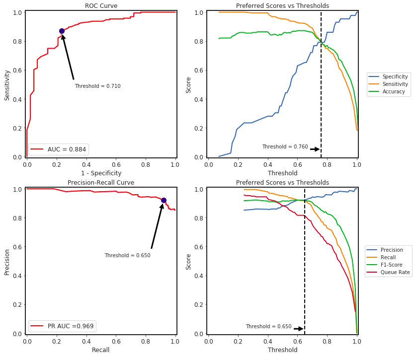
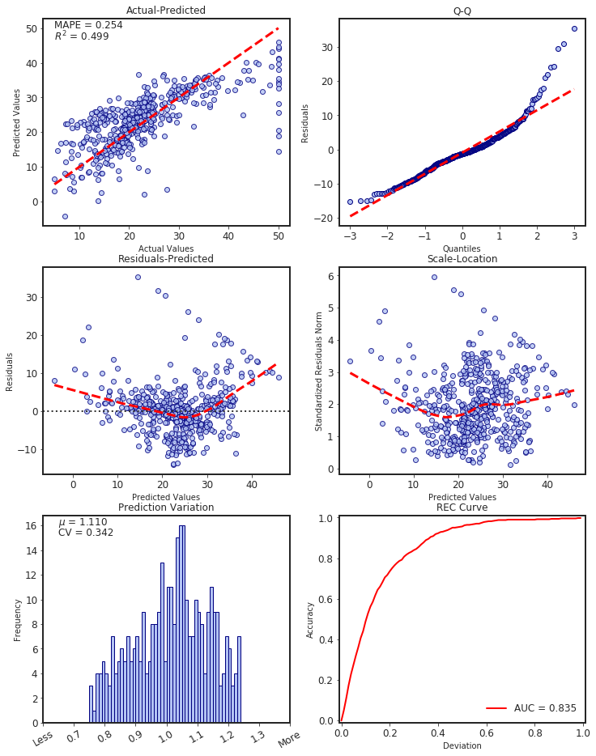

# Summary

SlickML is a machine learning library for Python. With SlickML, you can save more time on ML-Automation and ML-Tuning. Machine learing consists of many importants tricks that can only be learned in industry while dealing with production and deployment. Thus, the main philosophy of SlickML is to bring simplicity to produce more effective models with a minimal amount of code [@ideeple2018].

-
-

# Acknowledgements

We thank the many contributors that created examples, wrote documentation, and reported bugs. You can find [an up-to-date
list of contributors on GitHub](https://github.com/slickml/slick-ml/graphs/contributors).

# References
